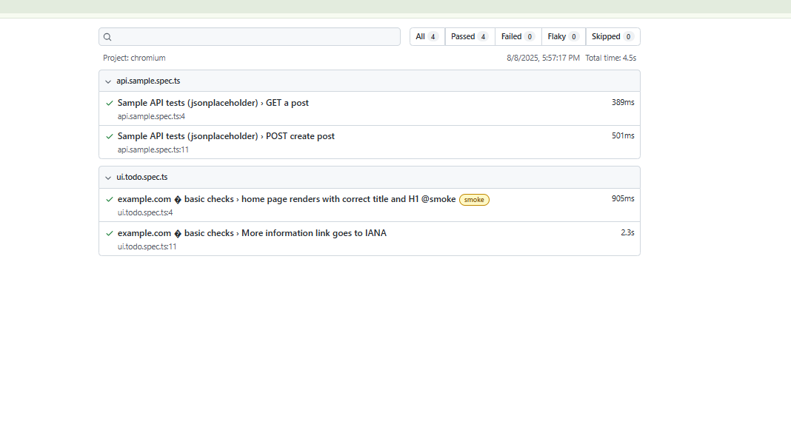

# QA Automation Starter — Ashlynn Ellis


I built this small Playwright + TypeScript suite to demonstrate how I set up **stable, maintainable automation** from scratch: UI + API checks, HTML reports, and a clean GitHub Actions pipeline. It’s intentionally minimal, readable, and easy to extend.

---

## What’s inside
- **UI smoke tests** against a deterministic target (`example.com`) using stable selectors.
- **API smoke tests** (jsonplaceholder) for simple GET/POST sanity.
- **HTML report** published as a CI artifact on every run.
- **CI workflow** (Chromium for stability) that’s fast and green.
- Clear structure and defensive waits to reduce flakes.

### Screenshot


---

## Quick start

### Windows (PowerShell)
```powershell
npm install
npx playwright install --with-deps
$env:BASE_URL="https://example.com/"
npx playwright test --project=chromium --reporter=html
npx playwright show-report
macOS / Linux
bash
Copy
Edit
npm install
npx playwright install --with-deps
export BASE_URL="https://example.com/"
npx playwright test --project=chromium --reporter=html
npx playwright show-report
Repo structure
lua
Copy
Edit
tests/
  ui.todo.spec.ts
  api.sample.spec.ts
  a11y.spec.ts
.github/
  workflows/
    ci.yml
reporters/
  slack-reporter.js
utils/
  personas.ts
docs/
  report.png
playwright.config.ts
package.json
tsconfig.json
README.md
LICENSE
Notes on design
Stability first: Chromium in CI; enable more browsers locally if needed.

Defensive waits: Guard for slow loads to avoid noisy flakes.

Artifacts for handoff: HTML report + screenshots/video on failure.

Configure
Default baseURL is https://example.com/. Override with BASE_URL env var or edit playwright.config.ts.

Roadmap / nice-to-haves
Accessibility sweep (axe-core + Playwright)

“Flake hunter” retry job under poor network

Visual regression sample

Optional Slack summary via a reporter

Built by: Aris Ashlynn Ellis · LinkedIn: https://www.linkedin.com/in/ashlynn-e-287979156 · Email: pellis5@students.towson.edu
License: MIT
